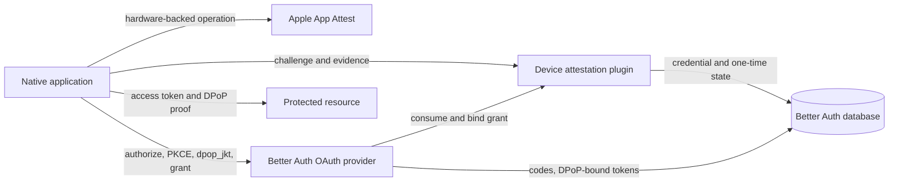
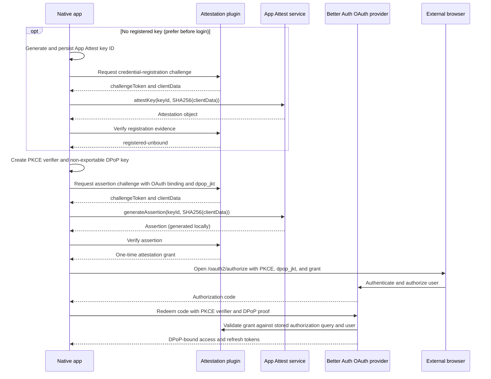

# Device Attestation for Better Auth

- Status: implemented alpha design; stable-release requirements remain open
- Target package: `@grablair/better-auth-device-attestation`
- Initial provider: Apple App Attest
- Target Better Auth line: 1.7
- Last reviewed: 2026-07-15

## 1. Overview

`@grablair/better-auth-device-attestation` adds device-attestation verification
to Better Auth. It provides a server plugin, an inferred client plugin, provider
adapters, and optional OAuth Provider composition. Its core responsibilities are
challenge issuance, evidence verification, persistent attestation credentials,
assertion counters, user binding, short-lived grants, policy evaluation, and
safe diagnostics.

The current alpha supports Apple App Attest on Node.js 20 or newer. Its provider
boundary leaves room for a later Android Play Integrity provider without
pretending that Play Integrity has App Attest's persistent-key and assertion
counter model.

The package owns the complete App Attest verification decision. External
libraries may supply audited cryptographic or parsing primitives, but no
dependency may bypass the package's structural checks, policy stages,
diagnostics, or conformance suite.

## 2. Design basis

The design follows these platform constraints:

- App Attest uses an initial attestation to register a hardware-backed key and
  subsequent assertions with a strictly increasing counter.
- Account-based applications should use a distinct App Attest key for each user
  account on a device.
- WebAuthn authenticator data uses `AT` for attested credential data and `ED`
  for a trailing CBOR extension map. Both flags change the byte layout.
- iOS 27 adds launch validation category and bundle version extensions to
  attestation and assertion authenticator data. A rollout policy must support
  clients that predate those extensions without ignoring malformed extensions
  when they are present.
- Better Auth plugins can define namespaced endpoints, schemas, hooks,
  rate-limit rules, and inferred clients. Better Auth 1.7 adapter primitives can
  atomically consume one-time values and guard counter transitions.
- The Better Auth OAuth Provider accepts authorization extension parameters and
  RFC 9449 `dpop_jkt`. Its integration point must be version-pinned and
  contract-tested until attestation enforcement has a dedicated documented hook.

These constraints produce two distinct flows:

1. Register a durable attestation credential once. Registration stores an
   unbound credential but does not authorize a user or mint an OAuth grant.
2. Generate a fresh assertion for each protected OAuth authorization. A
   short-lived, one-time grant binds the accepted assertion to the OAuth client,
   redirect URI, PKCE challenge, scopes, resources, OpenID nonce, and DPoP JWK
   thumbprint.

Challenges and grants use Better Auth's `verification` model. Only long-lived
attestation credentials require a plugin-defined table.

## 3. Goals

The first stable release must:

- verify Apple App Attest attestations and assertions according to Apple's
  published server contract;
- bind an attestation credential to at most one Better Auth user;
- bind an OAuth authorization to both verified App Attest evidence and the same
  non-exportable DPoP key used at the token endpoint;
- support Better Auth database adapters through the public adapter and schema
  contracts;
- make replay-sensitive transitions atomic across processes;
- preserve a non-transferable credential tombstone after revocation or user
  deletion;
- store the complete unsigned 32-bit assertion-counter range on every supported
  adapter and rotate rather than wrap at exhaustion;
- bound the lifetime and creation rate of unbound credentials;
- keep client errors generic while producing safe, actionable server events;
- support an explicit extension-presence policy for clients that do not emit iOS
  27 extensions;
- strictly validate iOS 27 distribution extensions whenever they are present;
- provide a typed client plugin without embedding native Apple APIs in the
  server package;
- ship as ESM with declarations, a documented export map, package provenance,
  conformance fixtures, and a supported-version matrix.

## 4. Non-goals

The first release does not:

- identify a physical device or expose a stable cross-application device ID;
- guarantee that a jailbroken or otherwise deeply compromised operating system
  can never produce acceptable evidence;
- make App Attest fraud receipts a synchronous login dependency;
- trust a client-reported operating-system version or `isSupported` result;
- silently downgrade when attestation is unavailable;
- support simulators or development evidence in a production application unless
  the host deliberately configures a separate development application;
- include Android support in `0.1`;
- support edge runtimes in `0.1` without a tested X.509 and ASN.1 implementation
  for those runtimes;
- expose raw CBOR, ASN.1 objects, certificates, receipts, or internal parser
  structures as its policy API.

## 5. Terminology

| Term                   | Meaning                                                                                                                  |
| ---------------------- | ------------------------------------------------------------------------------------------------------------------------ |
| Attestation credential | A provider-backed credential registered with the plugin. For App Attest this is a Secure Enclave key certified by Apple. |
| Evidence               | An App Attest attestation object, App Attest assertion, or future provider verdict submitted for verification.           |
| Challenge              | A short-lived, one-time server value whose hash is supplied to the platform attestation API.                             |
| Binding                | The exact authentication transaction attributes protected by the challenge.                                              |
| Attestation grant      | A short-lived, one-time opaque value proving that the plugin accepted evidence for a particular binding.                 |
| Provider               | An implementation such as App Attest or, later, Play Integrity.                                                          |
| Policy                 | Host-supplied rules applied only after cryptographic and structural verification succeeds.                               |
| Distribution signals   | App Attest validation category and bundle version values from authenticator extensions.                                  |

The public API will use "attestation credential," not "device identity." App
Attest proves properties about an application instance and a provider key; it
does not give the server a general-purpose identity for the physical device.

## 6. Threat model

We assume an attacker can:

- control every byte of every HTTP request;
- send malformed, oversized, truncated, or deeply nested CBOR and ASN.1 data;
- replay, reorder, delay, and concurrently submit challenges, grants,
  attestations, assertions, authorization codes, and DPoP proofs;
- copy evidence between applications, environments, users, OAuth clients, and
  authorization transactions;
- run a modified application on hardware that cannot access the legitimate App
  Attest private key;
- learn opaque values delivered to their own client instance;
- cause application or server requests to fail at any point;
- inspect the complete open-source implementation.

We assume the attacker cannot:

- forge Apple's App Attest certificate chain or signatures;
- extract a legitimate App Attest private key from the Secure Enclave under the
  platform's stated security model;
- extract a correctly configured non-exportable DPoP private key;
- compromise the server, its database, or its configured secrets.

If those assumptions change, the plugin can still contribute a signal, but it
cannot restore trust by itself. Fraud receipts and host risk policy are the
appropriate additional layers for large-scale abuse from compromised devices.

## 7. Security invariants

The implementation must preserve these falsifiable properties:

1. No attestation or assertion is accepted without a random, unexpired,
   single-use server challenge.
2. A challenge can be consumed successfully by at most one request across all
   server processes.
3. A grant can authorize at most one authentication transaction.
4. A grant is valid only for the provider, purpose, application, credential, and
   binding for which it was issued.
5. Invalid certificate, signature, nonce, App ID, environment, key identifier,
   counter, or challenge evidence can never be changed into an allow decision by
   a host policy callback.
6. Development App Attest evidence is rejected unless the matched application
   configuration explicitly permits it.
7. If authenticator extensions are encoded, their structure and configured
   distribution policy are enforced. Malformed or partial extension data is
   never treated as absent.
8. Missing extensions are accepted only under an explicit compatibility policy
   and never because of a client-reported OS version.
9. One App Attest credential can bind to at most one Better Auth user.
10. An App Attest assertion counter advances through a guarded atomic update;
    two concurrent requests cannot both accept the same prior counter state.
11. An OAuth grant protected with `dpop_jkt` can result only in tokens bound by
    Better Auth to that same JWK thumbprint.
12. Raw evidence and authentication secrets never enter normal diagnostics.
13. Ordinary refreshes and protected API requests do not invoke App Attest; they
    use the DPoP binding Better Auth already established.
14. Deleting a user or revoking a credential never makes the same provider key
    registerable to another user.
15. A credential counter is stored and compared across the full `0..4294967295`
    range and never wraps to zero.
16. An unbound credential cannot remain active indefinitely.

## 8. Architecture

The plugin runs inside the Better Auth server and uses Better Auth's schema,
adapter, endpoint, client-inference, and lifecycle APIs. Provider code is
isolated behind a typed contract so each platform can implement its actual
evidence and credential lifecycle without weakening the shared replay and
binding invariants.



Provider evidence is interpreted only by the plugin. The OAuth Provider
integration consumes the plugin's one-time grant when an authorization code is
redeemed. That integration seam uses public APIs, an exact prerelease version,
and black-box contract tests.

## 9. Better Auth plugin design rules

The implementation will follow Better Auth's public plugin conventions:

- export a server plugin with `id: "device-attestation"`;
- create routes with `createAuthEndpoint` from `better-auth/api`;
- use kebab-case routes under the unique `/device-attestation` prefix;
- use hooks rather than request-only middleware when enforcement must also apply
  to direct server API calls;
- define plugin rate-limit rules for client-initiated challenge and verify
  endpoints;
- define the credential table through the plugin `schema` property so Better
  Auth's CLI can generate Drizzle, Prisma, or SQL schema changes;
- add schema field/model-name overrides through a typed `schema` option before
  the stable release;
- use `ctx.context.adapter` and documented `internalAdapter` helpers rather than
  importing an application ORM;
- use Better Auth's atomic `consumeOne`/verification consumption and
  `incrementOne` primitives instead of implementing read-then-write replay
  protection;
- provide a `BetterAuthClientPlugin` with `$InferServerPlugin` for endpoint
  inference;
- attach OpenAPI metadata and stable error codes to public endpoints;
- expose no React state or browser assumptions from the server package;
- import only documented Better Auth entry points such as `better-auth`,
  `better-auth/api`, and `better-auth/client`;
- never import `@better-auth/core` source files, generated chunks, or another
  plugin's internal modules;
- pin exact Better Auth prereleases during alpha development and run contract
  tests before expanding the peer range.

The package will not patch Better Auth options after initialization or locate
other plugins by undocumented object shape. Optional OAuth composition will be
created explicitly by the host configuration.

## 10. Alpha public API

The API separates the provider, the Better Auth plugin, and optional OAuth
composition:

```ts
import { betterAuth } from "better-auth";
import { jwt } from "better-auth/plugins";
import { oauthProvider } from "@better-auth/oauth-provider";
import {
  appAttest,
  createDeviceAttestation,
} from "@grablair/better-auth-device-attestation";

const attestation = createDeviceAttestation({
  providers: [
    appAttest({
      applications: [
        {
          appId: "TEAMID.com.example.mobile",
          environment: "production",
          extensions: {
            presence: "if-present",
            allowedValidationCategories: [2, 4],
            validateBundleVersion: (version) => allowedBuilds.has(version),
          },
        },
      ],
      receipt: {
        onReceipt: enqueueFraudAssessment,
        failureMode: "report",
      },
    }),
  ],
  purposes: {
    credentialRegistration: {
      challengeTtlSeconds: 120,
    },
    oauthAuthorization: {
      protectedClientIds: ["mobile-app"],
      challengeTtlSeconds: 120,
      grantTtlSeconds: 300,
      requireDpopJkt: true,
    },
  },
  diagnostics: {
    report: reportAttestationEvent,
  },
});

export const auth = betterAuth({
  plugins: [
    jwt(),
    attestation.serverPlugin,
    oauthProvider(
      attestation.protectOAuthProvider({
        loginPage: "/login",
        consentPage: "/consent",
      }),
    ),
  ],
});
```

`createDeviceAttestation()` returns one stateful composition object for one
`betterAuth()` instance:

```ts
interface DeviceAttestationComposition {
  serverPlugin: BetterAuthPlugin;

  protectOAuthProvider<T extends OAuthProviderOptions>(options: T): T;
}
```

The factory will throw if the same composition is initialized by more than one
Better Auth instance. This prevents an adapter captured during plugin
initialization from being accidentally reused across applications.

The inferred client is conventional:

```ts
import { createAuthClient } from "better-auth/client";
import { deviceAttestationClient } from "@grablair/better-auth-device-attestation/client";

const authClient = createAuthClient({
  plugins: [deviceAttestationClient()],
});
```

The separate `./client` export will contain no Apple implementation. A future
native helper package can compose the typed HTTP client with Swift, Kotlin, or
React Native bridges without making native code a dependency of every server
consumer.

## 11. Alpha provider contract

The alpha contract models the persistent credential lifecycle App Attest needs:

```ts
interface DeviceAttestationProvider {
  readonly id: string;
  readonly maxEvidenceBytes: number;
  decodeKeyId(value: string): Uint8Array;
  verifyRegistration(input: RegistrationInput): Promise<RegistrationResult>;
  verifyAssertion(input: AssertionInput): Promise<AssertionResult>;
}
```

Registration results contain the verified application, environment, SPKI public
key, zero counter, normalized distribution metadata, and an optional opaque
untrusted receipt. Assertion results contain only the advanced counter and
normalized distribution metadata.

This interface intentionally reflects the first implemented provider. Android
Play Integrity does not have the same persistent credential and counter model;
before Android support, the boundary will evolve through a reviewed capability
contract without weakening the App Attest invariants. A future normalized
assurance type may contain only shared facts:

```ts
interface FutureAttestationAssurance<Signals> {
  provider: string;
  applicationId: string;
  environment: "development" | "production";
  verifiedAt: Date;
  signals: Signals;
}
```

App Attest signals remain App Attest-specific:

```ts
interface AppAttestSignals {
  validationCategory?: number;
  bundleVersion?: string;
  extensionsPresent: boolean;
}
```

Play Integrity will later return its own typed verdict structure. We will not
invent misleading shared fields such as a universal `deviceTrusted` boolean.

## 12. HTTP endpoints

### `POST /device-attestation/challenge`

Creates a one-time challenge for a configured purpose.

Registration request:

```json
{
  "provider": "app-attest",
  "applicationId": "TEAMID.com.example.mobile",
  "operation": "register",
  "keyId": "base64-apple-key-identifier",
  "purpose": "credential-registration"
}
```

Registration establishes an unbound credential and does not authorize a user or
OAuth transaction. Native clients should perform it after generating a new key
and, when practical, before the user starts login.

OAuth request:

```json
{
  "provider": "app-attest",
  "applicationId": "TEAMID.com.example.mobile",
  "operation": "assert",
  "keyId": "base64-apple-key-identifier",
  "purpose": "oauth-authorization",
  "binding": {
    "clientId": "mobile-app",
    "redirectUri": "com.example.mobile:/oauth/callback",
    "codeChallenge": "base64url-pkce-challenge",
    "codeChallengeMethod": "S256",
    "dpopJkt": "base64url-jwk-thumbprint",
    "scope": "openid offline_access",
    "resources": ["https://api.example.com"],
    "nonce": "optional-oidc-nonce"
  }
}
```

For assertion, the key must already identify an active credential. A client that
has no registered credential completes registration first, then requests a
separate OAuth assertion challenge. An initial attestation object is never
accepted in place of that assertion.

Response:

```json
{
  "challengeToken": "opaque-high-entropy-value",
  "clientData": "base64url-bytes-to-hash",
  "expiresAt": "2026-07-14T20:02:00.000Z"
}
```

The native client computes `SHA-256(base64urlDecode(clientData))` and supplies
that 32-byte result to `attestKey` or `generateAssertion`. The client does not
construct a parallel canonical payload.

The server constructs `clientData` from a versioned domain separator, a 32-byte
random nonce, the provider, operation, purpose, key lookup hash, and a canonical
binding hash. Returning the exact bytes eliminates cross-language JSON
canonicalization errors while cryptographically binding the evidence to the
intended transaction.

Only a keyed hash of `challengeToken` and the expected verification state are
stored. The challenge request is rejected before allocation if its strings,
arrays, or decoded evidence identifiers exceed configured bounds.

### `POST /device-attestation/verify`

Consumes the challenge and verifies the evidence:

```json
{
  "challengeToken": "opaque-high-entropy-value",
  "keyId": "base64-apple-key-identifier",
  "evidence": "base64-attestation-or-assertion"
}
```

Successful registration returns credential state only:

```json
{
  "credentialState": "registered-unbound"
}
```

Registration never returns a grant. Successful assertion verification returns a
one-time grant:

```json
{
  "grantToken": "opaque-high-entropy-value",
  "expiresAt": "2026-07-14T20:05:00.000Z",
  "credentialState": "asserted"
}
```

The endpoint atomically consumes the challenge before expensive verification. A
network or verification failure therefore requires a new challenge. This is
intentional: it prevents the same proof attempt from being replayed and keeps
the state machine deterministic.

Registration is idempotent at the credential boundary. If the server commits a
new credential but the response is lost, a later assertion request using the
same high-entropy key identifier can discover that the credential is already
registered. The client must not call `attestKey` again merely because it missed
the HTTP response.

### Account-management endpoints

The server plugin will also expose session-protected endpoints to list and
retire the current user's credentials. Their responses contain server IDs,
provider, application ID, creation time, last use, and status, but never the
provider key identifier, public key, counter, receipt, or raw signals.

Retirement is permanent for that provider key. The row becomes a tombstone: its
unique lookup key and minimum audit timestamps remain, its public key and
distribution metadata may be cleared according to retention policy, and it can
never return to active status or bind to another user. User deletion first
retires every bound credential, then sets the optional user reference to null;
the foreign key must not cascade-delete the credential row.

In the alpha integration, retirement prevents future assertions and attested
authorizations. It does not claim to terminate OAuth tokens already issued by
Better Auth. A future `terminateDeviceAccess` operation requires a documented
Better Auth association between the attestation credential and its access and
refresh-token family, followed by atomic credential retirement and token-family
revocation. Stable release documentation and endpoint names must state the
implemented semantics exactly.

## 13. Ephemeral state

Challenges and grants will use Better Auth's core `verification` model, the same
pattern used by Better Auth's one-time-token plugin.

Identifiers are namespaced and hashed:

```text
device-attestation:challenge:<SHA-256(challengeToken)>
device-attestation:grant:<SHA-256(grantToken)>
```

The `value` is a versioned, strictly parsed JSON object containing only:

- provider and operation;
- purpose;
- application lookup value;
- credential lookup value;
- expected client-data hash;
- canonical binding hash;
- grant credential ID where applicable;
- protocol version.

The record has a short `expiresAt`. It contains no raw challenge, key
identifier, evidence, certificate, receipt, DPoP proof, authorization code, PKCE
verifier, or credentials.

Consumption uses Better Auth's atomic verification-value consumption, which is
backed by the 1.7 `consumeOne` adapter primitive. We will not emulate atomicity
with a read followed by a delete.

## 14. Persistent credential schema

The plugin contributes one model through its schema:

| Field                | Type             | Rules                                                                                                            |
| -------------------- | ---------------- | ---------------------------------------------------------------------------------------------------------------- |
| `id`                 | Better Auth ID   | Primary identifier generated by the configured adapter.                                                          |
| `lookupKey`          | string           | Unique SHA-256 over provider, application ID, and provider key identifier. The raw key identifier is not stored. |
| `provider`           | string           | Indexed provider ID.                                                                                             |
| `applicationId`      | string           | Indexed App ID or provider application identity, limited to 255 characters for adapter portability.              |
| `environment`        | string           | `development` or `production`.                                                                                   |
| `publicKey`          | string, optional | Base64 SPKI while usable; input/returned disabled in schema metadata.                                            |
| `counter`            | number           | Unsigned 32-bit counter stored with Better Auth `bigint: true`; valid range `0..4294967295`.                     |
| `userId`             | string, optional | Better Auth user reference using `onDelete: "set null"`; a deletion hook first creates a revoked tombstone.      |
| `bindingVersion`     | number           | Starts at zero and supports atomic first-user claiming.                                                          |
| `status`             | string           | `active`, `expired`, or `revoked`; no transition returns an expired or revoked row to active.                    |
| `validationCategory` | number, optional | Last verified App Attest UInt32 category, stored with Better Auth `bigint: true`.                                |
| `bundleVersion`      | string, optional | Last verified App Attest bundle version.                                                                         |
| `extensionsPresent`  | boolean          | Whether the last accepted evidence contained the Apple extensions.                                               |
| `createdAt`          | date             | Registration time.                                                                                               |
| `updatedAt`          | date             | Better Auth on-update timestamp.                                                                                 |
| `boundAt`            | date, optional   | First successful user binding time.                                                                              |
| `unboundExpiresAt`   | date, optional   | Required while `userId` is null and active; cleared atomically on binding.                                       |
| `revokedAt`          | date, optional   | Permanent retirement time.                                                                                       |
| `revocationReason`   | string, optional | Closed, non-sensitive reason enum; never a raw exception or user-supplied value.                                 |
| `lastUsedAt`         | date, optional   | Last accepted assertion or grant redemption.                                                                     |

The alpha does not yet accept model and field-name overrides. Supporting Better
Auth-style overrides remains a stable-release requirement. The package does not
expose a Drizzle or Prisma schema as its canonical API; generated examples are
documentation, while the plugin schema remains authoritative.

The raw Apple receipt is deliberately absent. A receipt callback can enqueue it
into host-owned encrypted storage for asynchronous fraud assessment. This keeps
large opaque evidence out of the authentication database and lets each host
define retention and access controls.

## 15. Atomic state transitions

### Challenge and grant consumption

Use `internalAdapter.consumeVerificationValue()` and require Better Auth 1.7's
race-safe implementation. Exactly one concurrent caller can receive the stored
state.

### Assertion counter

The verifier reads the current credential, verifies that the assertion counter
is an unsigned integer greater than the stored value, and calculates the delta.
It then calls `incrementOne` with both credential ID and the previously read
counter in the `where` guard:

```ts
const updated = await adapter.incrementOne({
  model: "deviceAttestationCredential",
  where: [
    { field: "id", value: credential.id },
    { field: "counter", value: credential.counter },
    { field: "status", value: "active" },
  ],
  increment: { counter: nextCounter - credential.counter },
  set: { lastUsedAt: new Date() },
});
```

A `null` result means another request advanced or revoked the credential. The
request is rejected and must obtain a fresh challenge and assertion. We will not
accept an out-of-order lower assertion merely because it has a different counter
value.

The schema uses Better Auth's `bigint: true` database attribute while the
provider API keeps the value as a JavaScript number, which safely represents
every UInt32. Adapters such as PostgreSQL may materialize `bigint` as a decimal
string; the plugin strictly normalizes only canonical unsigned decimal strings
at the adapter boundary before provider verification. Adapter contract tests
must cover `2147483648`, `4294967294`, and `4294967295`. After accepting
`4294967295`, the credential is retired and the client must register a new key;
zero or any lower value is never accepted as wraparound.

### First user binding

An unbound credential is claimed during the first successful authorization by an
`incrementOne` guarded on `bindingVersion: 0`, `userId: null`, and active
status. The operation increments `bindingVersion` and sets `userId`. If the
credential is already bound to the same user, redemption may continue. If it is
bound to another user, redemption is rejected and the client must use a
different App Attest key.

The same guarded update requires `unboundExpiresAt` to be in the future, sets
`boundAt`, and clears `unboundExpiresAt`. Expired unbound credentials cannot be
claimed.

### Unbound expiration and cleanup

Registration sets `unboundExpiresAt` from the configured application policy. The
default will be measured before release and must be finite. Challenge and
verification rate limits apply separately by provider, application, and the
host's privacy-preserving request key. Hosts can additionally cap active unbound
registrations per application.

Expired unbound rows transition to `expired` before cleanup. Because they were
never user-bound, implementations may hard-delete them after a bounded retention
window. Bound, revoked, or formerly bound rows are tombstones and are never
hard-deleted by normal cleanup. Metrics report active unbound rows, expirations,
cleanup volume, and registration throttling without credential identifiers.

## 16. OAuth authorization flow

Key registration is a distinct, one-time lifecycle operation. The native client
should generate and attest an unbound key during deliberate setup, account-add,
or idle preparation when practical. If preparation has not happened, login may
perform registration as a bounded fallback. In either case, authorization
requires a new assertion after registration and before the external browser
opens. Human authentication still happens exclusively in the browser according
to RFC 8252.



The authorization request includes two extension parameters:

```text
dpop_jkt=<RFC-7638-thumbprint>
device_attestation=<opaque-grant-token>
```

The grant binding covers:

- OAuth client ID;
- redirect URI;
- PKCE S256 challenge and method;
- `dpop_jkt`;
- normalized scope set;
- normalized resource indicator set;
- OpenID Connect nonce when present;
- plugin protocol version.

`state` remains the native client's CSRF and response-correlation value. It is
not needed to prevent grant substitution because the grant itself is random,
single-use, and bound to the PKCE and DPoP keys, but implementations may add a
hash of `state` without exposing it in storage.

At authorization-code redemption, the OAuth integration:

1. runs only for configured protected public clients and only for
   `authorization_code`;
2. obtains `device_attestation` and the original binding values from Better
   Auth's documented authorization-code `verificationValue`;
3. atomically consumes the attestation grant;
4. compares the grant's binding hash with the canonical authorization query;
5. atomically binds or checks the attestation credential against the resolved
   Better Auth user;
6. returns no custom token fields unless the host's existing callback does;
7. allows Better Auth to validate PKCE, `dpop_jkt`, the token-endpoint DPoP
   proof, and all token state.

The helper composes rather than replaces a host-provided
`customTokenResponseFields` callback. Device-attestation enforcement runs first;
the host callback runs only after it succeeds.

### Better Auth 1.7 integration caveat

In the inspected 1.7.0-rc.1 implementation, `customTokenResponseFields` runs
after the authorization code, client, PKCE, user, and session are resolved but
before DPoP resolution and token creation. Throwing prevents token issuance,
which makes it a viable public alpha integration point. However, the callback is
named for response customization rather than security enforcement, and its
ordering relative to DPoP is not yet a documented stability guarantee.

We will therefore:

- pin the exact Better Auth RC during initial development;
- run a black-box contract test proving that invalid or missing attestation
  prevents all token and refresh-token rows from being created;
- prove that the stored authorization query retains both extension parameters;
- prove that Better Auth rejects a DPoP proof whose JWK thumbprint differs from
  the grant-bound `dpop_jkt`;
- open an upstream design request for a dedicated `beforeTokenIssuance` hook
  that receives the verified client, user, authorization request, and resolved
  sender constraint after DPoP validation;
- move to that hook when available without changing the native protocol.

The current ordering has one reliability consequence: an attestation grant may
be consumed before a later DPoP failure. Better Auth already consumes the
authorization code before that same DPoP failure, so the user must restart the
authorization transaction either way. The plugin does not create an additional
successful retry path that Better Auth otherwise supports.

Refresh-token grants do not require another attestation grant. Better Auth
carries the DPoP confirmation into the refresh family and verifies a new DPoP
proof during refresh. A host can require reauthorization after an assurance age
or risk event by revoking the refresh family. Credential retirement blocks new
authorizations immediately; terminating already-issued token families remains a
separate capability until Better Auth exposes a documented credential-to-token
association and revocation hook.

## 17. App Attest client key lifecycle

The native integration must model keys explicitly:

```text
absent -> generated-pending -> registered-unbound -> bound-active
                         \-> invalid
bound-active -> revoked
bound-active -> invalid
```

- Generate one App Attest key per user account per device, following Apple's
  guidance.
- Persist the Apple key identifier immediately after `generateKey` because the
  private key cannot be rediscovered without it.
- Mark it `generated-pending` locally until the server confirms registration.
- Prefer registering a newly generated unbound key during deliberate setup,
  account-add, or idle preparation so the Apple-network-dependent attestation is
  not normally on the interactive login critical path.
- If no registered key is available at login, register once as a bounded
  fallback, then obtain a separate assertion challenge; registration evidence
  itself never authorizes OAuth.
- Do not generate a replacement merely because an HTTP response is lost; first
  attempt a server assertion/status recovery using the existing key ID.
- Preserve registered keys across logout. Logout removes tokens, not hardware
  identity material.
- Store multiple local key references by previously known account identity.
- When authorizing an unknown account, use a pending unbound key. Bind it to the
  user resolved by the first successful code exchange.
- If the browser authenticates a different user than the selected credential's
  owner, reject and repeat with a new or correctly associated key.
- Serialize `generateAssertion` calls per key. This reduces out-of-order
  counters and unnecessary server rejections.
- Rotate only after explicit server revocation, unrecoverable key loss, provider
  invalidation, or account-switch recovery.

The plugin cannot enforce correct local persistence, so the native lifecycle
will be documented as part of the protocol and covered by reference-client
state-machine tests when a native helper package is added.

## 18. App Attest verifier

The provider verifier is split into bounded layers:

```text
transport decoding
  -> CBOR envelope parsing
  -> WebAuthn authenticator-data parsing
  -> certificate and nonce verification
  -> App ID, environment, key, and counter verification
  -> extension decoding
  -> host distribution policy
  -> normalized assurance
```

Each layer returns a typed value or an internal stable failure code. It does not
return partially trusted structures after an error.

### Input bounds

Before decoding, the endpoint validates strict Base64 and configurable byte
limits for evidence, key IDs, strings, arrays, and binding data. Defaults will
be based on captured valid fixtures with generous headroom and recorded in
tests; they will not be silently increased in response to malformed production
traffic.

CBOR decoding must reject:

- more than one top-level item;
- indefinite or excessive nesting beyond the configured decoder limits;
- duplicate map keys;
- trailing bytes;
- non-buffer byte strings where bytes are required;
- unexpected top-level properties or property types.

### Attestation verification

For an attestation object, the implementation must:

1. decode exactly one CBOR object with `fmt`, `attStmt`, and `authData`;
2. require `fmt === "apple-appattest"`;
3. require a byte-string certificate chain and receipt in `attStmt`;
4. validate the complete presented chain to the pinned Apple App Attestation
   Root CA, including certificate validity, issuer/subject relationships,
   signature algorithms, CA constraints, and leaf usage;
5. calculate `clientDataHash` from the exact server-issued client-data bytes;
6. calculate Apple's nonce over authenticator data and `clientDataHash` and
   compare it in constant time with certificate extension
   `1.2.840.113635.100.8.2`;
7. hash the credential certificate's X9.62 uncompressed P-256 public key and
   compare it with the strictly decoded Apple key identifier;
8. parse authenticator data structurally rather than using fixed offsets after
   the credential ID;
9. verify the RP ID hash against
   `SHA-256(teamIdentifier + "." + bundleIdentifier)`;
10. require counter zero;
11. require an allowed App Attest AAGUID and reject development AAGUIDs unless
    the matched application explicitly permits them;
12. require the `AT` flag and verify credential ID equality;
13. decode exactly one COSE key, require the expected EC2/P-256/ES256
    parameters, and verify that its coordinates match the certified public key;
14. parse extensions only from the offset established by decoding that COSE
    item;
15. return the SPKI public key, normalized signals, environment, and receipt
    only after every mandatory step succeeds.

The verifier will use constant-time byte comparison for hashes, nonces, key
identifiers, RP IDs, and other fixed-length security values.

### Assertion verification

For an assertion, the implementation must:

1. decode exactly one CBOR object containing only a byte-string signature and
   byte-string authenticator data;
2. require a structurally valid minimum authenticator data length;
3. require `AT` to be clear for an assertion;
4. calculate and verify the Apple assertion signature using the registered
   public key and Apple's documented client-data construction;
5. verify the RP ID hash for the stored application;
6. decode the counter as unsigned big-endian UInt32 and require it to be greater
   than the stored counter;
7. parse at most one extension map using the App Attest profile described below
   and reject any bytes that do not form that one complete map;
8. validate distribution signals through the same application policy used at
   registration;
9. atomically advance the stored counter and last-use metadata;
10. return normalized assurance only after the guarded update succeeds.

Known-answer tests must establish the precise ECDSA hashing behavior against
Apple's official sample and a sanitized real-device fixture.

## 19. Authenticator extensions and iOS 27

The authenticator parser follows the App Attest data contract rather than
assuming that every Apple field follows generic WebAuthn extension signaling:

- `AT` (`0x40`) means attested credential data follows the fixed 37-byte prefix;
- `ED` (`0x80`) means one CBOR extension map follows the attested credential
  data, or follows the fixed prefix for assertions;
- Apple's official App Attest validation fixture appends its distribution
  extension map with `ED` clear, so the App Attest provider permits exactly one
  trailing CBOR extension map after the structurally decoded credential key or
  assertion prefix even when `ED` is clear;
- the COSE credential key is decoded as one CBOR item to discover its actual
  length;
- any trailing bytes that do not decode to exactly one complete extension map
  are rejected.

The generic authenticator-data parser keeps this behavior behind an explicit App
Attest profile option. Other WebAuthn consumers do not silently gain the
unflagged-extension rule. Extension presence is determined from the decoded
bytes, not inferred solely from `ED` and not from a client-supplied OS version.

When present, extension containers may be represented by the installed CBOR
decoder as either a plain JavaScript object or a `Map`. The parser:

- accepts only those two container shapes;
- reads only own properties from object-shaped values;
- ignores prototype-chain properties;
- never spreads an untrusted decoded object;
- requires `apple_bundle_version_01` to be a string;
- accepts `apple_validation_category_01` as either an exactly four-byte
  `Buffer`/`Uint8Array` decoded with unsigned little-endian UInt32 semantics, or
  a non-negative safe integer for decoder and fixture compatibility;
- rejects wrong byte lengths, negative numbers, unsafe integers, floats,
  strings, and all other types;
- rejects a present Apple extension set if either required Apple field is
  malformed or missing;
- bounds and ignores unknown extension values rather than exposing them to host
  policy.

Production application configuration must explicitly select extension presence
policy:

```ts
type AppAttestExtensionPresence = "if-present" | "required";
```

`if-present` means evidence with no encoded extension map can pass the
compatibility path, while any encoded extensions are strictly enforced.
`required` means a decoded extension map must be present. There is no `ignore`
mode.

The host must also configure allowed categories and bundle-version policy for
every production application. A reasonable TestFlight/App Store policy is
categories `2` and `4`, but the package will not assume those categories for all
consumers. Category `3` development evidence and simulator substitutes do not
become acceptable because extension presence is optional.

Rollout should move from `if-present` to `required` only after the host no
longer supports pre-iOS-27 clients. The decision cannot depend on an OS version
sent by the client. Assertions from an existing credential can introduce the new
fields after an OS upgrade; accepted values update the credential's last
verified distribution metadata.

## 20. Policy boundary

Cryptographic validity and application policy are separate stages.

The provider verifier owns non-overridable checks:

- structure and input bounds;
- certificate chain and validity;
- nonce and signature;
- App ID and environment;
- provider key binding;
- assertion counter;
- challenge and grant replay;
- typed extension decoding.

The host policy owns deployment choices after those checks succeed:

- allowed application IDs;
- development versus production application definitions;
- extension presence rollout;
- allowed distribution categories;
- accepted bundle versions;
- purposes that require attestation;
- maximum assurance age;
- receipt and risk response.

Policy returns a typed allow or deny decision with a stable internal reason. It
never receives raw evidence and cannot turn a verifier error into allow.

Bundle versions are evaluated by a callback or explicit set because real
applications commonly permit more than one distributed build at a time. The
plugin compares Apple's `apple_bundle_version_01`, which corresponds to the
distributed build version (`CFBundleVersion`), not the marketing version.

Unsupported devices require a host-designed alternative. A client claim that
`DCAppAttestService.isSupported` is false is not evidence. The secure defaults
are rejection or a different server-verifiable step-up flow; silent allow is not
an option exposed by the plugin.

## 21. Diagnostics and privacy

Client responses remain stable and generic. Expected rejection does not expose
certificate, parser, binding, policy, or database details.

The host may configure a structured diagnostic sink:

```ts
interface DeviceAttestationDiagnosticEvent {
  provider: string;
  operation: "challenge" | "register" | "assert" | "grant";
  stage:
    | "request"
    | "challenge"
    | "cbor"
    | "authenticator-data"
    | "certificate-chain"
    | "nonce"
    | "app-identity"
    | "environment"
    | "distribution-metadata"
    | "signature"
    | "counter"
    | "credential-binding"
    | "grant-binding"
    | "storage"
    | "unexpected";
  reason: string;
  retryable: boolean;
  measurements?: {
    evidenceBytes?: number;
    authenticatorDataBytes?: number;
    flags?: number;
    extensionBytes?: number;
  };
}
```

Reason values are a closed enum in implementation, not arbitrary exception
messages. Safe measurements are bounded numeric facts useful for diagnosing
protocol drift.

The plugin never includes these values in a diagnostic event:

- attestation objects or assertions;
- certificates, public keys, Apple receipts, or provider tokens;
- challenges, challenge tokens, or grant tokens;
- Apple key identifiers or internal credential lookup keys;
- authorization codes, PKCE verifiers, access tokens, or refresh tokens;
- DPoP proofs, JWKs, or thumbprints;
- email addresses, passwords, cookies, credentials, or request bodies;
- arbitrary thrown error messages or stacks from expected rejection.

Unexpected failures can be correlated through host telemetry request IDs, but
the plugin will not generate a device correlation identifier. The default
diagnostic sink is no-op.

## 22. Client errors and recovery

The public error surface is intentionally smaller than the internal reason
surface:

| Public code                              | Meaning                                             | Client action                                                  |
| ---------------------------------------- | --------------------------------------------------- | -------------------------------------------------------------- |
| `DEVICE_ATTESTATION_INVALID_REQUEST`     | Request shape or configured purpose is invalid.     | Fix the client; do not loop.                                   |
| `DEVICE_ATTESTATION_CHALLENGE_EXPIRED`   | Challenge is absent, expired, or already used.      | Obtain one new challenge.                                      |
| `DEVICE_ATTESTATION_CREDENTIAL_REQUIRED` | The requested assertion credential is not active.   | Generate/register a new key through an explicit recovery path. |
| `DEVICE_ATTESTATION_REJECTED`            | Evidence or configured policy rejected the request. | Stop automatic retries; offer recovery or support.             |
| `DEVICE_ATTESTATION_GRANT_REQUIRED`      | Protected authorization lacks a valid grant.        | Restart the attested authorization once.                       |
| `DEVICE_ATTESTATION_RETRY`               | A transient provider or storage failure occurred.   | Retry with bounded backoff and a new challenge.                |

The server does not tell an untrusted client whether rejection came from a
certificate, App ID, distribution category, bundle version, signature, or
counter. Recovery classifications are based on safe client action, not on
revealing verification internals.

## 23. Availability, latency, and abuse controls

Initial attestation calls Apple and is substantially more expensive than a local
assertion. We keep it off the ordinary API and refresh paths.

The plugin will:

- create one App Attest key and attestation per user account per device;
- allow clients to prepare registration outside the login path while requiring
  local credential state to suppress duplicate registration attempts;
- use local assertions for later authorization transactions;
- enforce configurable Better Auth rate limits separately for challenge and
  verify endpoints;
- enforce request-size and decoder-complexity bounds before cryptography;
- use short challenge and grant lifetimes;
- consume invalid attempts so a single challenge cannot drive repeated expensive
  verification;
- expose metrics for attempts, latency by stage, public result class, and
  provider availability without high-cardinality identifiers;
- define receipt delivery as asynchronous and non-blocking by default;
- require a fresh assertion for each protected OAuth authorization and no App
  Attest call for ordinary refresh;
- document that native assertion generation must be serialized per key.

Proposed default rate limits and byte limits will be benchmarked before they
become API guarantees. The design does not claim measured latency or memory
costs yet.

## 24. Receipt and fraud-risk integration

App Attest receipts are bounded opaque inputs for Apple's server-to-server fraud
metric. A receipt extracted from an otherwise valid attestation remains
untrusted until its own PKCS #7 signature, certificate chain, App ID, creation
time, attested public-key binding, environment, and validity window are
verified. Receipt verification is not required to decide whether the App Attest
key registration itself is cryptographically valid.

The App Attest provider exposes:

```ts
interface UntrustedAppAttestReceipt {
  readonly bytes: Uint8Array;
}

receipt: {
  onReceipt?: (
    receipt: UntrustedAppAttestReceipt,
    context: SafeReceiptContext,
  ) => Promise<void>;
  failureMode?: "report" | "reject-registration";
}
```

The default failure mode is `report`. The callback receives a bounded
`UntrustedAppAttestReceipt` only after the surrounding attestation is fully
verified. The type exposes bytes for queueing but no parsed or trusted claims.
The callback should enqueue encrypted host-owned storage and return quickly. The
plugin never logs or returns the receipt.

Refreshing the receipt, validating its PKCS #7 structure, interpreting the risk
metric, retention, and fraud policy belong in a later optional provider module.
They must not silently turn the synchronous login path into an Apple server
dependency.

## 25. Android evolution

Android support will use Play Integrity standard requests, not an emulation of
App Attest keys.

Play Integrity differs in important ways:

- the application requests an on-demand integrity token;
- Google decrypts and evaluates the token server-to-server;
- standard requests bind a request hash and provide provider replay handling;
- verdicts include app, licensing, device, activity, and optional environment
  signals;
- there is no App Attest-style persistent credential public key or monotonic
  assertion counter owned by this plugin.

The common challenge/grant and policy pipeline can remain, while the provider
returns `interaction-verdict` assurance. Android will have its own typed
signals, caching rules, quotas, remediation, and server credentials. We will not
add Android fields to the App Attest credential model or flatten all provider
signals into one trust score.

## 26. Testing strategy

The current alpha automates the official Apple production vector, synthetic
production and development registration vectors, distribution-extension
regressions, mutated verifier inputs, deterministic malformed-CBOR sampling,
memory-adapter lifecycle and concurrency checks, a PostgreSQL atomicity and
UInt32 lane, inferred-client type checks, enforced coverage thresholds, and
packed ESM/declaration validation. Sanitized real-device vectors, the remaining
adapter matrix, and end-to-end OAuth token issuance remain stable-release
criteria rather than completed alpha coverage.

### Parser and verifier tests

- Apple documented development and production known-answer vectors;
- a sanitized real device attestation and assertion sequence with documented
  provenance and no production identity data;
- small synthetic CBOR fixtures for every authenticator-data layout;
- attestation `AT` with `ED` clear;
- attestation `AT` and `ED` with object-shaped extension output;
- assertion with `ED` clear and assertion with `ED` set;
- category `2` and `4` encoded as four-byte little-endian byte strings;
- safe numeric category decoder compatibility;
- invalid category lengths and types;
- missing, inherited, duplicate, and partial extension properties;
- bundle-version mismatch and invalid type;
- development and production AAGUID policy;
- malformed/truncated authenticator fields at every boundary;
- multiple and trailing CBOR items;
- wrong COSE key type, curve, algorithm, and key coordinates;
- wrong root, intermediate, leaf, validity, nonce, App ID, key ID, and counter;
- assertion signature and RP ID failures;
- fuzz and property tests proving the parser rejects without hanging, throwing
  uncontrolled exceptions, or allocating beyond configured bounds.

### State and concurrency tests

- exactly one of concurrent challenge consumers succeeds;
- exactly one of concurrent grant consumers succeeds;
- exactly one assertion advances a shared prior counter;
- a higher counter racing a lower counter cannot leave the stored counter
  decreased;
- counters above signed Int32 round-trip on every adapter and exhaustion retires
  the credential without wraparound;
- one credential cannot bind to two users;
- user deletion preserves a revoked lookup-key tombstone and cannot make the key
  transferable;
- registration never creates an authorization grant;
- a newly registered credential must produce a separate assertion before an
  OAuth grant can be minted;
- lost registration response recovers without re-attesting the same key;
- expired unbound credentials cannot bind and bounded cleanup never deletes a
  formerly bound tombstone;
- revoked credentials never become active through re-registration;
- expired verification values fail consistently.

### Better Auth contract tests

- plugin endpoints are available through `auth.api`;
- the client plugin infers the expected methods and bodies;
- `auth generate` includes the credential model for Drizzle and Prisma;
- schema model/field overrides work;
- supported adapters implement atomic verification consumption and guarded
  increments;
- the authorization request preserves `device_attestation` and `dpop_jkt` in the
  authorization-code verification value;
- missing, expired, mismatched, or reused grants prevent token issuance;
- a grant binds to the Better Auth user resolved from the code;
- host `customTokenResponseFields` composition remains intact;
- refresh grants do not require new App Attest evidence;
- credential retirement prevents future authorization, and any endpoint that
  claims to terminate device access proves revocation of associated token
  families;
- DPoP JKT mismatch prevents tokens;
- no access or refresh token row exists after rejected attestation enforcement;
- direct server invocation cannot bypass enforcement that HTTP invocation uses.

### Adapter matrix

Before `0.1.0`, CI must cover:

- Better Auth memory adapter for fast endpoint behavior;
- built-in SQLite/Kysely;
- Drizzle with SQLite;
- Drizzle with PostgreSQL;
- generated Prisma schema and at least one Prisma integration lane;
- the minimum and latest supported Better Auth 1.7 versions.

Additional adapters can be documented as unverified until their atomic 1.7
primitives pass the same contract suite.

### Package tests

- ESM import on Node 20, 22, and 24;
- declaration and export-map validation with `publint` and Are The Types Wrong;
- install and run from the packed npm tarball, not only workspace source;
- no undeclared or workspace-only dependencies in the tarball;
- npm provenance and contents review before release.

## 27. Repository and release practices

The package remains `private: true` until the first implementation passes the
package and verifier acceptance criteria. Alpha development pins `better-auth`
and `@better-auth/oauth-provider` to an exact 1.7 prerelease. Published peer
ranges expand only after the compatibility matrix passes.

Releases will use:

- Conventional Commits and generated changelogs;
- Changesets once the first publishable API exists;
- npm trusted publishing from GitHub Actions with provenance;
- protected release environments and least-privilege workflow permissions;
- Dependabot or Renovate for runtime and development dependencies;
- CodeQL and dependency review;
- private vulnerability reporting and coordinated advisories;
- signed tags where practical;
- no release directly from an unreviewed working tree.

The package will publish compiled ESM and declarations, not TypeScript source as
the runtime entry point. Better Auth and the OAuth Provider remain peer
dependencies so applications do not load duplicate auth runtimes.

## 28. Implementation work packages

### Work package A: Better Auth skeleton

- Implement server and inferred client plugins.
- Define stable public error codes, endpoint schemas, OpenAPI metadata, rate
  limits, schema overrides, and diagnostic types.
- Add Better Auth endpoint, client-inference, CLI-generation, and adapter
  contract tests.

Acceptance: the empty provider harness works through Better Auth public APIs on
the supported adapter matrix without internal imports.

### Work package B: Bounded authenticator parser

- Implement exact CBOR envelope and WebAuthn authenticator-data parsers.
- Implement `AT`/`ED`, variable COSE length, object/Map extension handling,
  UInt32 decoding, input bounds, duplicate/trailing rejection, and fuzz tests.

Acceptance: every structural fixture produces the expected typed value or stable
failure code, and fuzzing does not produce uncontrolled exceptions.

### Work package C: App Attest cryptography

- Implement chain, validity, nonce, key, App ID, AAGUID, counter, and signature
  verification against known-answer fixtures.
- Add production/development configuration and distribution policy.
- Add the optional receipt callback.

Acceptance: the official and sanitized device fixtures pass only under their
matching application policy, and every mutated security field fails.

### Work package D: Atomic credential lifecycle

- Implement credential registration, assertion, counter CAS, revocation,
  first-user binding, and recovery behavior.
- Store ephemeral state through Better Auth verification values.

Acceptance: concurrency tests prove single consumption, monotonic counters, and
one-user binding across independent auth instances sharing a database.

### Work package E: OAuth Provider composition

- Implement canonical OAuth binding and `device_attestation` authorization
  parameter.
- Compose the public token-response callback without losing host behavior.
- Add black-box PKCE, DPoP, token issuance, refresh, error, and replay tests.
- Open the Better Auth upstream extension-point request.

Acceptance: no protected authorization-code exchange can create tokens without
one matching, unexpired, one-time attestation grant bound to the same DPoP key.

### Work package F: Reference integration and public release

- Publish a minimal Better Auth server example and a platform-neutral native
  protocol walkthrough covering registration, assertion, account switching,
  refresh, logout, recovery, and revocation.
- Complete API review, documentation, package smoke tests, provenance,
  disclosure policy, and changelog.
- Remove `private: true` only in the reviewed release change.

Acceptance: `0.1.0` installs from npm, generates its Better Auth schema, runs
the example flow, and passes the supported version/adapter matrix. Every
challenge and grant carries a protocol version so consumers can support a
bounded transition between two protocol versions.

## 29. Open decisions and upstream requirements

These questions must be resolved before a stable release:

1. Will Better Auth document `customTokenResponseFields` as a supported
   enforcement callback, or add a pre-token-issuance hook after DPoP resolution?
   Alpha can use the current public callback only with an exact version pin and
   black-box contract tests.
2. Will Better Auth formally guarantee preservation of authorization extension
   parameters in `verificationValue.query`? Current 1.7 source and types expose
   the original query, but the plugin should get maintainer confirmation.
3. Which documented Better Auth hook can associate the issued access and refresh
   token family with an attestation credential and revoke it during device
   access termination? Until this exists, the plugin exposes credential
   retirement only.
4. Which X.509/ASN.1 implementation gives the best verifiable chain behavior and
   smallest Node runtime surface? The choice will be made through known-answer
   and malformed-chain tests, not package popularity alone.
5. What byte, unbound-retention, and rate-limit defaults cover observed valid
   Apple evidence and registration traffic with sufficient headroom? Measure
   sanitized fixtures before documenting fixed defaults.
6. Should receipt processing remain a callback in the main package or become a
   separate optional export once the fraud-metric implementation exists?

None of these questions changes the native challenge, evidence, or grant
protocol. That keeps the design reversible while the Better Auth integration
point matures.

## 30. Release acceptance criteria

The first stable release is ready only when:

- all security invariants in this document have automated coverage;
- App Attest registration and assertion pass official and sanitized real-device
  known-answer fixtures;
- malformed and adversarial parsers pass fuzz and resource-bound tests;
- challenge, grant, counter, and first-user binding are race-safe on PostgreSQL;
- all supported adapters preserve the complete UInt32 counter range and reject
  wraparound;
- user deletion and credential retirement preserve non-transferable tombstones;
- unbound credentials expire, are throttled, and have bounded cleanup;
- Better Auth generates the documented schema for Drizzle and Prisma;
- protected OAuth code exchange requires one valid grant and matching DPoP JKT;
- refresh uses Better Auth DPoP without invoking App Attest;
- iOS 27 extensions are strictly validated when present and absence follows the
  explicit configured rollout policy;
- expected client rejection returns generic errors and safe server diagnostics;
- receipt callbacks expose untrusted opaque bytes and no risk claim is accepted
  without independent receipt verification;
- package contents, types, ESM imports, license, security policy, and provenance
  pass release checks;
- the reference integration completes registration, assertion, account switch,
  refresh, logout, recovery, and revocation using only documented public APIs.

## 31. References

- [Better Auth plugin development](https://better-auth.com/docs/concepts/plugins)
- [Better Auth hooks](https://better-auth.com/docs/concepts/hooks)
- [Better Auth database and plugin schemas](https://better-auth.com/docs/concepts/database)
- [Better Auth OAuth Provider](https://better-auth.com/docs/plugins/oauth-provider)
- [Better Auth 1.7.0-rc.1 OAuth Provider source](https://github.com/better-auth/better-auth/tree/v1.7.0-rc.1/packages/oauth-provider/src)
- [Apple: Establishing your app's integrity](https://developer.apple.com/documentation/devicecheck/establishing-your-app-s-integrity)
- [Apple: Validating apps that connect to your server](https://developer.apple.com/documentation/devicecheck/validating-apps-that-connect-to-your-server)
- [Apple: App Attest object validation guide](https://developer.apple.com/documentation/devicecheck/attestation-object-validation-guide)
- [Apple: Assessing fraud risk](https://developer.apple.com/documentation/devicecheck/assessing-fraud-risk)
- [Apple WWDC26: Secure your apps with App Attest](https://developer.apple.com/videos/play/wwdc2026/201/)
- [WebAuthn Level 3 authenticator data](https://www.w3.org/TR/webauthn-3/#sctn-authenticator-data)
- [RFC 8252: OAuth 2.0 for Native Apps](https://www.rfc-editor.org/rfc/rfc8252)
- [RFC 9449: OAuth 2.0 Demonstrating Proof of Possession](https://www.rfc-editor.org/rfc/rfc9449)
- [RFC 9700: Best Current Practice for OAuth 2.0 Security](https://www.rfc-editor.org/rfc/rfc9700)
- [Google Play Integrity standard requests](https://developer.android.com/google/play/integrity/standard)
